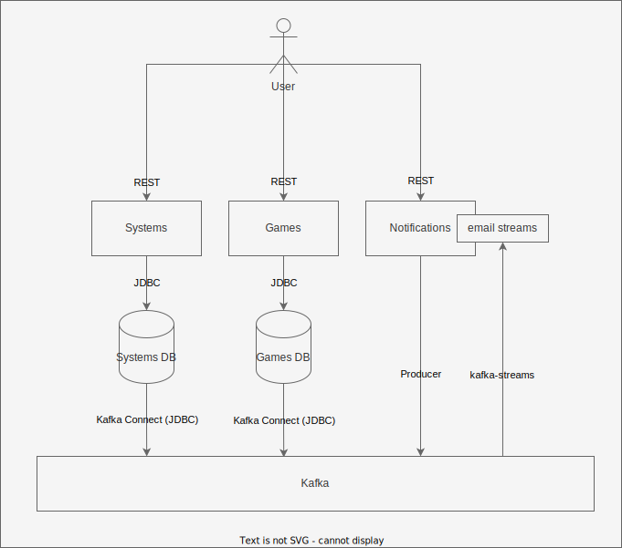

# Kafka Games

Kafka Games is an application that allows Gaming Systems and Games to be added to a collection.

## Overview



The application uses The following microservices to add the expected entites to the system:
- Systems: To manage gaming systems
- Games: To manage games

Each of the microservices databases are then connected to Kafka via Kafka connect to produce messages whenever systems
are added, updated or deleted

## Prerequisites

- [Docker Compose](https://docs.docker.com/compose/)

## Running Locally

Start the external systems (DB, etc):
```shell
# run from the .docker folder
cd .docker

# run the systems in the background
docker-compose up -d
```

Start up the applications:
```shell
# run from systems folder
cd systems

./gradlew bootRun
```

```shell
# run from games folder
cd games

./gradlew bootRun
```

Add the connectors:
```shell
# run from the root folder
./gradlew addConnectors
```

> Note: Kafka Connect can take a minute or two to start so if this fails try waiting a minute before running.
> This also only needs to be ran once. If ran multiple times it will produce a 409 status code

## To Do

- Updates
- Validation on endpoints
- Stream processing apps (dashboard for games and consoles?)
- Tests
- Hook everything into the root gradle file for easier startups (single command to start everything)
- Ephemeral ports for apps and use a gateway for apps?